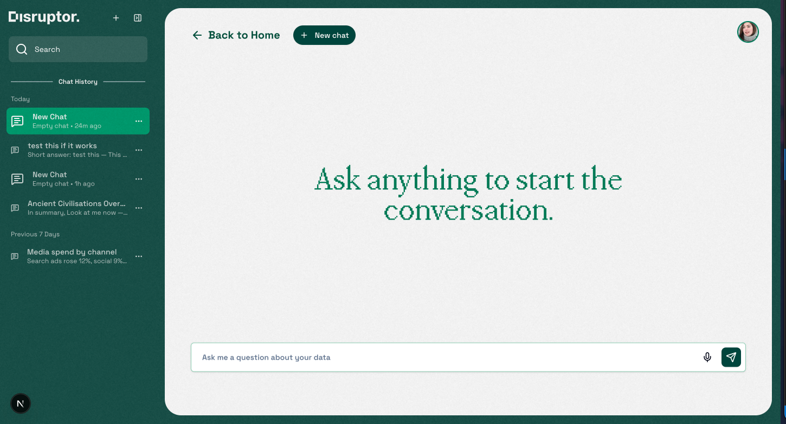

# Disruptor — AI-Powered Insights Hub

Disruptor is a Next.js application that unifies authenticated dashboards with a conversational, AI-style chat experience. It ships with a clean, modern UI, sticky/collapsible navigation, and a simple file-backed auth layer suitable for local development and demos.

## Highlights

- Robust layout with sticky, collapsible side navigation and mobile drawer
- Authenticated dashboard (email/password) using server actions and JWT cookies
- Chat experience with local persistence (per-thread history, rename, delete, like/copy)
- Clean component library via shadcn/ui + Radix primitives and Tailwind CSS v4
- Hero section with a video modal

## Tech Stack

- Framework: Next.js 15 (App Router), React 19, TypeScript
- Styling: Tailwind CSS v4, CSS variables, custom fonts (PP Mondwest, Big Caslon CC)
- UI: shadcn/ui (Radix), lucide-react icons
- Forms & Validation: react-hook-form, zod
- Auth: jose (JWT), Next.js middleware, server actions

## Quick Start

Prerequisites: Node.js 18+ and npm (or pnpm/yarn).

1. Install dependencies

```bash
npm install
```

2. Configure environment

Create a `.env.local` file with at least:

```
AUTH_SECRET=replace-with-a-long-random-string
```

3. Run the dev server

```bash
npm run dev
```

Open http://localhost:3000

## Screenshots

Dashboard overview


Chat view



Auth layout background


Replace these with real UI captures anytime (e.g., drop `png/jpg/gif` files into `public/readme/` and reference them here).

## Demo

Short video walkthrough (sample):

https://www.w3schools.com/html/mov_bbb.mp4

For a project-specific demo, export a screen recording to `public/demo.mp4` (or `.gif`) and link it here.

## Scripts

- `npm run dev` — Start the app with Turbopack
- `npm run build` — Production build
- `npm run start` — Start the production server
- `npm run lint` — Run ESLint

## Project Structure

- `app/` — App Router pages and layouts
- `/` (Sign In), `/signup` (Sign Up)
  - `/dashboard` (Home + feature pages)
  - `/dashboard/chat` and `/dashboard/chat/[id]` (chat experience)
- `components/` — Reusable UI and feature components
  - `dashboard/` (layout, sidebar, hero, feature grid, user menu)
  - `chat/` (sidebar, view, message bubble, composer)
  - `ui/` (shadcn/ui wrappers: button, input, dialog, form, etc.)
- `actions/` — Server actions (e.g., `actions/auth.ts`)
- `lib/` — Utilities and client-side stores (e.g., `lib/chat-store.ts`)
- `data/` — Local JSON storage for demo auth (`data/users.json`)
- `middleware.ts` — Route protection and redirects
- `types/` — Shared types and validation schemas

## Features in Detail

### Authentication

- Sign up and sign in with email/password; validation via zod
- File-backed user store (`data/users.json`) and SHA-256 password hashing (demo only)
- JWT session cookie (`session`) using jose, 7-day expiry
- Middleware-enforced protection: `/dashboard` requires auth; `/` and `/signin` redirect away if authenticated

Production note: For real deployments, switch to a database (e.g., Prisma + Postgres) and strong password hashing (bcrypt/argon2). Ensure `AUTH_SECRET` is set to a long, random value.

### Navigation & Layout

- Main menu sidebar: sticky on desktop, collapsible; mobile drawer with overlay
- Chat sidebar: sticky/collapsible variant tailored to chat
- Search in main menu filters groups/items; pressing Enter navigates to the first match
- Plus/minus icon toggles for menu groups; consistent with the design system

### Chat Experience

- LocalStorage-backed threads with seeded samples
- Per-thread messages, rename, delete (with undo), and “new chat” flow
- Message actions: like/dislike (local meta), copy, placeholder regenerate
- Composer with Enter-to-send

### UI & Theming

- Tailwind v4 with CSS variables and custom fonts
- shadcn/ui + Radix primitives for accessible components
- Toast notifications with a global Toaster
- Hero section includes a modal video player (Radix Dialog)

## Configuration

Environment variables:

- `AUTH_SECRET` — Required in production; secret used to sign JWTs (defaults to `dev-secret` in development if unset)

Next.js config lives in `next.config.ts`. Tailwind config is embedded via `app/globals.css` (Tailwind v4).

## Development Notes

- The auth layer is intentionally minimal (file-backed) to simplify local dev and demos.
- The chat experience is client-only by default; to connect a real model/backend, replace the `fakeAssistantReply` in `lib/chat-store.ts` with a server call and persist messages in your data store.

## Deployment

- Recommended: Vercel or any Node hosting that supports Next.js
- Set `AUTH_SECRET` in the deployment environment
- Build and start:

```bash
npm run build
npm run start
```

## Roadmap (suggested)

- Replace file-backed auth with a database + secure hashing
- Connect chat to a real AI backend and persist conversation history
- Add role-based access and user profiles
- Add tests (unit/e2e) and CI checks

---

If you have questions or want help extending the app (auth hardening, chat backend, or additional dashboards), open an issue or reach out.

# disruptortwo

# disruptorr

# disruptorr
